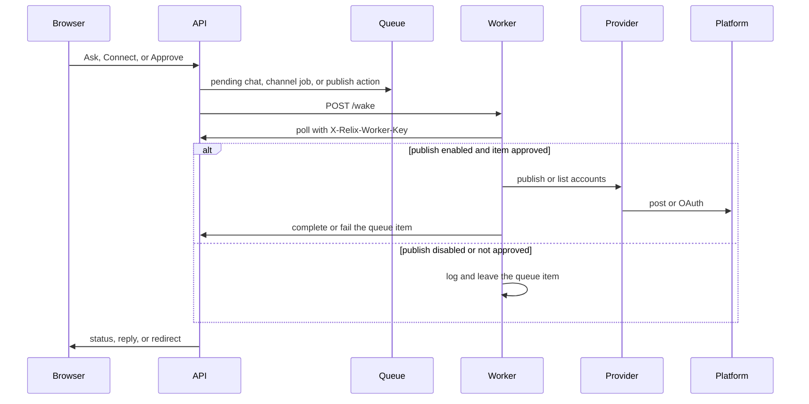
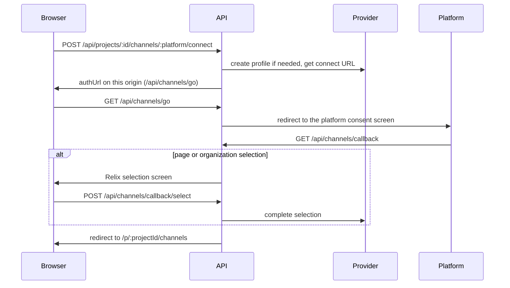

# Relix agents

Before this change these ran as external scheduled routines; now they live in `apps/worker`.

The worker is a small TypeScript process. It calls the Relix API with `X-Relix-Worker-Key` and, when a posting provider is configured, calls that provider from the server. The browser never talks to the provider and never sees the provider name.

Start it with `npm run worker` from the repo root (API already running), or let the `worker` service in `docker compose` start it. It listens on `WORKER_PORT` (default `8790`).

## Schedule

Every `WORKER_INTERVAL_SECONDS` seconds (default 60, minimum 5) the worker runs one tick: chat replies, channel sync, publish, then provision. A tick already in progress is skipped.

The API can also wake a tick immediately. Set `RELIX_BRIDGE_WEBHOOK` to `http://worker:8790/wake` (compose does this by default). The API sends `Authorization: Bearer <RELIX_BRIDGE_WEBHOOK_AUTH>`. That value must equal `RELIX_WORKER_API_KEY`. The worker also accepts the same secret in `X-Relix-Worker-Key`. `GET /health` on the worker needs no key.

A failed tick is logged. The next interval runs anyway. One job throwing does not roll back the jobs that already finished in that tick.

## Chat replies

`apps/worker/src/jobs/chat-replies.ts`

| | |
|---|---|
| Trigger | Interval tick, or `POST /wake` after a chat message is queued |
| Endpoints | `GET /api/chat/pending-all`, then `POST /api/chat/reply` |
| Input | Pending jobs `{ id, projectId, text }` |
| Output | One assistant reply stored on that chat job |
| Env | `OPENAI_API_KEY`, `OPENAI_MODEL` (default `gpt-4o-mini`), `RELIX_API_URL`, `RELIX_WORKER_API_KEY` |

The system prompt is `RELIX_AGENT_SYSTEM_PROMPT` in `packages/shared`. Ask Relix stays inside the brand's posts, drafts, approvals, captions, calendar, and channels. The same prompt is used by `POST /api/projects/:id/chat/agent-reply`.

Failure handling:

- No `OPENAI_API_KEY`: the job returns without calling the model. The in-app agent path still tells the user the key is missing.
- Empty job, non-OK completion, or empty model text: that job is skipped and left pending.
- Before the reply is posted, vendor names and vendor URLs are removed, and claims such as "I published" or "email sent" are rewritten so the reply does not say a post went out or an email was sent.

## Channel sync

`apps/worker/src/jobs/channel-sync.ts`

| | |
|---|---|
| Trigger | Same tick |
| Endpoints | `GET /api/channel-jobs?status=pending`, `GET /api/projects/:pid/channels`, `POST /api/channel-jobs/:id/result`, `POST /api/projects/:pid/analytics/sync` |
| Input | Pending channel jobs and the project's provider profile id |
| Output | Job marked connected with username, connector name `Relix`, and a follower snapshot when the provider returns one |
| Env | `SOCIAL_PROVIDER` and that provider's key, plus the worker API env |

The worker lists accounts on the project's provider profile and matches the job platform (`twitter` also matches `x`).

Failure handling:

- `SOCIAL_PROVIDER=none` or a missing key: the job returns immediately and leaves channel jobs pending.
- No profile on the project, or no matching account: the job stays pending so a connect still in progress is not marked failed.
- Account ids stay on the worker request. The message stored for the browser is the username line, not the raw account id.

OAuth Connect (Channels and chat connector cards) does not wait on this job. The browser returns through `GET /api/channels/callback`, and the API writes the channel row itself.

## Publish

`apps/worker/src/jobs/publish.ts`

| | |
|---|---|
| Trigger | Same tick |
| Endpoints | `GET /api/ig/actions/pending-all`, `GET /api/projects/:pid/ig/queue`, `GET /api/projects/:pid/channels`, `POST /api/ig/actions/:id/complete` |
| Input | Pending actions whose live queue item is `approved` |
| Output | `{ externalPostId }` on success, or `{ status: "failed", error }` |
| Env | `WORKER_PUBLISH_ENABLED` (default `false`), `PUBLIC_BASE_URL`, `SOCIAL_PROVIDER` and its key |

Nothing is sent to a platform unless the live queue item is `approved`. Approval comes from Preview or an email `APPROVE`. A snapshot on the action is not enough. Retry only re-queues a previously approved item that failed. The worker does not approve drafts.

Failure handling:

- `WORKER_PUBLISH_ENABLED` is not `true`: the action is logged and skipped. It is not completed, so it stays pending until you turn publishing on.
- Publishing is on but no provider is configured: the action is completed as failed with `Posting service not configured`.
- Instagram is not connected: completed as failed with `Instagram is not connected`.
- Provider error or a result without an external id: completed as failed with the error string. The API sets the queue item to `failed`. Preview can retry that item.

Media paths that start with `/` are prefixed with `PUBLIC_BASE_URL` so the provider can fetch them.

## Provision

`apps/worker/src/jobs/provision.ts`

| | |
|---|---|
| Trigger | Same tick |
| Endpoints | `GET /api/provision/queue`, `POST /api/provision/:jobId/complete` |
| Input | Pending provision jobs |
| Output | Job marked done |
| Env | Worker API env only |

No external side effects. A job that is not `pending` is left alone.

## Connect path (API, not a worker job)

`state` is a short-lived HMAC signed with `JWT_SECRET` (project, platform, nonce, expiry). The query name is `s`, because some providers overwrite a parameter named `state`. The real provider URL is kept in memory on the API and is not returned in JSON.
