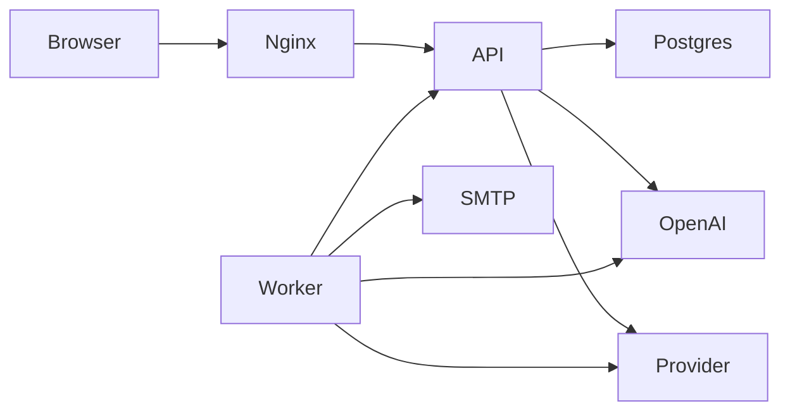

# Architecture

Relix is one repository. After `git clone`, the API, the browser UI, the worker, and the seed data are all here. Postgres is the only database. Optional network calls go to OpenAI, an SMTP server, or the posting provider named in `SOCIAL_PROVIDER`, using keys from `.env`.

```
.
├── apps/api          Express API, Prisma, posting-provider adapters, media files
│   ├── prisma        schema and migrations
│   ├── public/media  logos, generated images, brand reference images
│   └── src
│       ├── domain.ts request handlers and the approval gate
│       ├── seed.ts   idempotent import of data/ plus the admin user
│       ├── store.ts  Postgres snapshot used by the handlers
│       └── social    SocialProvider (none, zernio, ayrshare)
├── apps/web          Vite + React UI (Ask Relix, Preview, Channels, …)
├── apps/worker       scheduled jobs: chat, channels, publish, provision, email, analytics, images
├── packages/shared   UI types, the Ask Relix prompt, vendor-name scrubber
├── data              brand JSON imported by the seed (not the live database)
├── docs              setup, architecture, agents, posting providers
├── nginx             same-origin proxy for /api and /media
├── scripts           check-env and the brand-image renderer
└── docker-compose.yml
```

## Request path

The browser talks only to Relix. Nginx (or the Vite dev proxy) serves the UI and forwards `/api` and `/media` to the API. `GET /media/...` is public so image tags and the image job can load logos and brand references. Every other API route needs a session cookie or `X-Relix-Worker-Key`. The API calls OpenAI, SMTP, or the posting provider when those keys exist.



Approval stays on the API. The worker may send an approval link and may generate an image, but it posts to a social network only when `WORKER_PUBLISH_ENABLED=true` and the live queue item is `approved`.

## What is not in this repo

Platform consent screens still show the OAuth app name of whoever owns that platform's client id. That limit is described in `docs/SOCIAL-PROVIDERS.md`. There is no dependency on a hosted assistant, a Gmail connector, or a scheduler outside `apps/worker`.
